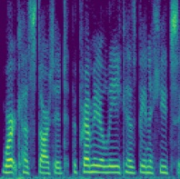

# 
 Cross-modal face and voice style transfer

Naoya Takahashi, Mayank K. Singh, Yuki Mitsufuji

# Introduction
This page provides the audio and image samples shown in the paper as well as some additional samples. All results on the audio-guided image translation, image-guided voice conversion, and latent-guided face & voice generation are obtained by the single proposed model. 
  

# Audio-guided image translation
The audio samples for the results shown in Fig.1a in the paper.

<table align="center"  style="text-align: center;">
  <thead>
    <tr>
      <th>Source</th>
      <th style="text-align: center;"></th>
      <th style="text-align: center;"></th>
      <th style="text-align: center;"></th>
      <th style="text-align: center;"></th>
    </tr>
  </thead>
  <tbody>
    <tr>
      <td>Reference</td>
      <td style="text-align: center;"> 
        <audio  controls="" style="width:150px;" preload="auto">
        <source src="media/A2I/ref/dk.wav"></audio></td>
      <td style="text-align: center;"> 
        <audio  controls="" style="width:150px;" preload="auto">
        <source src="media/A2I/ref/p302.wav"></audio></td>
      <td style="text-align: center;"> 
        <audio  controls="" style="width:150px;" preload="auto">
        <source src="media/A2I/ref/eh.wav"></audio></td>
      <td style="text-align: center;"> 
        <audio  controls="" style="width:150px;" preload="auto">
        <source src="media/A2I/ref/p300.wav"></audio></td>
    </tr>
    <tr>
      <td>Output</td>
      <td style="text-align: center;"></td>
      <td style="text-align: center;"></td>
      <td style="text-align: center;"></td>
      <td style="text-align: center;"></td>
    </tr>
  </tbody>
</table>
    

Additional results shown in the supplimental material.
<table align="center"  style="text-align: center;">
  <thead>
    <tr>
      <th>Source</th>
      <th style="text-align: center;"></th>
      <th style="text-align: center;"></th>
      <th style="text-align: center;"></th>
      <th style="text-align: center;"></th>
    </tr>
  </thead>
  <tbody>
      <tr>
      <td>Reference</td>
      <td style="text-align: center;"> 
        <audio  controls="" style="width:150px;" preload="auto">
        <source src="media/A2I/ref/p295.wav"></audio></td>
      <td style="text-align: center;"> 
        <audio  controls="" style="width:150px;" preload="auto">
        <source src="media/A2I/ref/eh.wav"></audio></td>
      <td style="text-align: center;"> 
        <audio  controls="" style="width:150px;" preload="auto">
        <source src="media/A2I/ref/p259.wav"></audio></td>
      <td style="text-align: center;"> 
        <audio  controls="" style="width:150px;" preload="auto">
        <source src="media/A2I/ref/5cQoGNEcc5Q.wav"></audio></td>
      </tr>
      <tr>
      <td>Output</td>
      <td style="text-align: center;"></td>
      <td style="text-align: center;"></td>
      <td style="text-align: center;"></td>
      <td style="text-align: center;"></td>
    </tr>
  </tbody>
</table>
    
    
# Image-guided voice conversion
The outputs are produced by converting the source voice using reference images. The images are from the image-only dataset (CelebA-HQ), hence, there is no ground truth voice. The first sample is the results shown in Fig.1b in the paper and rest are present in the supplemental material. 

<table align="center"  style="text-align: center;">
  <thead>
    <tr>
      <th>Source</th>
      <th style="text-align: center;"> <audio  controls="" style="width:150px;" preload="auto">
        <source src="media/I2A/p271_79.wav"></audio></th>
      <th style="text-align: center;"></th>
      <th style="text-align: center;"></th>
      <th style="text-align: center;"></th>
    </tr>
  </thead>
  <tbody>
      <tr>
      <td>Reference</td>
      <td style="text-align: center;"></td>
      <td style="text-align: center;"></td>
      <td style="text-align: center;"></td>
      <td style="text-align: center;"></td>
      </tr>
      <tr>
      <td>Output</td>
      <td style="text-align: center;">
         
        <audio  controls="" style="width:150px;" preload="auto">
        <source src="media/I2A/SRC_p271_79_TRG_female_195650.jpg.wav"></audio></td>
      <td style="text-align: center;">
         
        <audio  controls="" style="width:150px;" preload="auto">
        <source src="media/I2A/SRC_p271_79_TRG_female_064119.jpg.wav"></audio></td>
      <td style="text-align: center;">
         
        <audio  controls="" style="width:150px;" preload="auto">
        <source src="media/I2A/SRC_p271_79_TRG_male_116032.jpg.wav"></audio></td>
      <td style="text-align: center;">
         
        <audio  controls="" style="width:150px;" preload="auto">
        <source src="media/I2A/SRC_p271_79_TRG_male_156498.jpg.wav"></audio></td>
    </tr>
  </tbody>
</table>
    

<table align="center"  style="text-align: center;">
  <thead>
    <tr>
      <th>Source</th>
      <th style="text-align: center;"> <audio  controls="" style="width:150px;" preload="auto">
        <source src="media/I2A/p228_1.wav"></audio></th>
      <th style="text-align: center;"></th>
      <th style="text-align: center;"></th>
      <th style="text-align: center;"></th>
    </tr>
  </thead>
  <tbody>
      <tr>
      <td>Reference</td>
      <td style="text-align: center;"></td>
      <td style="text-align: center;"></td>
      <td style="text-align: center;"></td>
      <td style="text-align: center;"></td>
      </tr>
      <tr>
      <td>Output</td>
      <td style="text-align: center;">
         
        <audio  controls="" style="width:150px;" preload="auto">
        <source src="media/I2A/SRC_p228_1_TRG_female_031796.jpg.wav"></audio></td>
      <td style="text-align: center;">
         
        <audio  controls="" style="width:150px;" preload="auto">
        <source src="media/I2A/SRC_p228_1_TRG_female_058881.jpg.wav"></audio></td>
      <td style="text-align: center;">
         
        <audio  controls="" style="width:150px;" preload="auto">
        <source src="media/I2A/SRC_p228_1_TRG_male_047763.jpg.wav"></audio></td>
      <td style="text-align: center;">
         
        <audio  controls="" style="width:150px;" preload="auto">
        <source src="media/I2A/SRC_p228_1_TRG_male_083510.jpg.wav"></audio></td>
    </tr>
  </tbody>
</table>
   

# Latent-guided face and voice generation
We sample four latent codes, compute style vectors from the codes using the mapping network, and gnerate faces and voices from two source face and voices using the style vectors. The samples are the results shown in Fig.6 in the paper. 

<table align="center"  style="text-align: center;">
  <thead>
    <tr>
      <th>Source</th>
      <th style="text-align: center;">Output 1</th>
      <th style="text-align: center;">Output 2</th>
      <th style="text-align: center;">Output 3</th>
      <th style="text-align: center;">Output 4</th>
    </tr>
  </thead>
  <tbody>
      <tr>
      <td style="text-align: center;"></td>
      <td style="text-align: center;"></td>
      <td style="text-align: center;"></td>
      <td style="text-align: center;"></td>
      <td style="text-align: center;"></td> 
      </tr>
      <tr>
      <td> <audio  controls="" style="width:150px;" preload="auto">
        <source src="media/I2A/p271_79.wav"></audio></td>
      <td style="text-align: center;">
         
        <audio  controls="" style="width:150px;" preload="auto">
        <source src="media/L2AI/SRC_p271_79_Domain0_3.wav"></audio></td>
      <td style="text-align: center;">
         
        <audio  controls="" style="width:150px;" preload="auto">
        <source src="media/L2AI/SRC_p271_79_Domain1_8.wav"></audio></td>
      <td style="text-align: center;">
         
        <audio  controls="" style="width:150px;" preload="auto">
        <source src="media/L2AI/SRC_p271_79_Domain0_6.wav"></audio></td>
      <td style="text-align: center;">
         
        <audio  controls="" style="width:150px;" preload="auto">
        <source src="media/L2AI/SRC_p271_79_Domain1_9.wav"></audio></td>
    </tr>
    <tr>
    <td style="text-align: center;"></td>
    <td style="text-align: center;"></td>
    <td style="text-align: center;"></td>
    <td style="text-align: center;"></td>
    <td style="text-align: center;"></td> 
    </tr>
    <tr>
    <td> <audio  controls="" style="width:150px;" preload="auto">
    <source src="media/I2A/p228_1.wav"></audio></td>
    <td style="text-align: center;">
     
    <audio  controls="" style="width:150px;" preload="auto">
    <source src="media/L2AI/SRC_p228_1_Domain0_3.wav"></audio></td>
    <td style="text-align: center;">
     
    <audio  controls="" style="width:150px;" preload="auto">
    <source src="media/L2AI/SRC_p228_1_Domain1_8.wav"></audio></td>
    <td style="text-align: center;">
     
    <audio  controls="" style="width:150px;" preload="auto">
    <source src="media/L2AI/SRC_p228_1_Domain0_6.wav"></audio></td>
    <td style="text-align: center;">
     
    <audio  controls="" style="width:150px;" preload="auto">
    <source src="media/L2AI/SRC_p228_1_Domain1_9.wav"></audio></td>
</tr>    
  </tbody>
</table>
  
  
# Results on out-of-domain samples
To test the generalizability of the model to out-of-domain samples, we use FFHQ dataset, which is not included during training, for source images of audio-guided image translation. For audio, we use VCTK, LRS3, Wav2Lip, as well as VoxCeleb2, which is unseen during training.  

    

